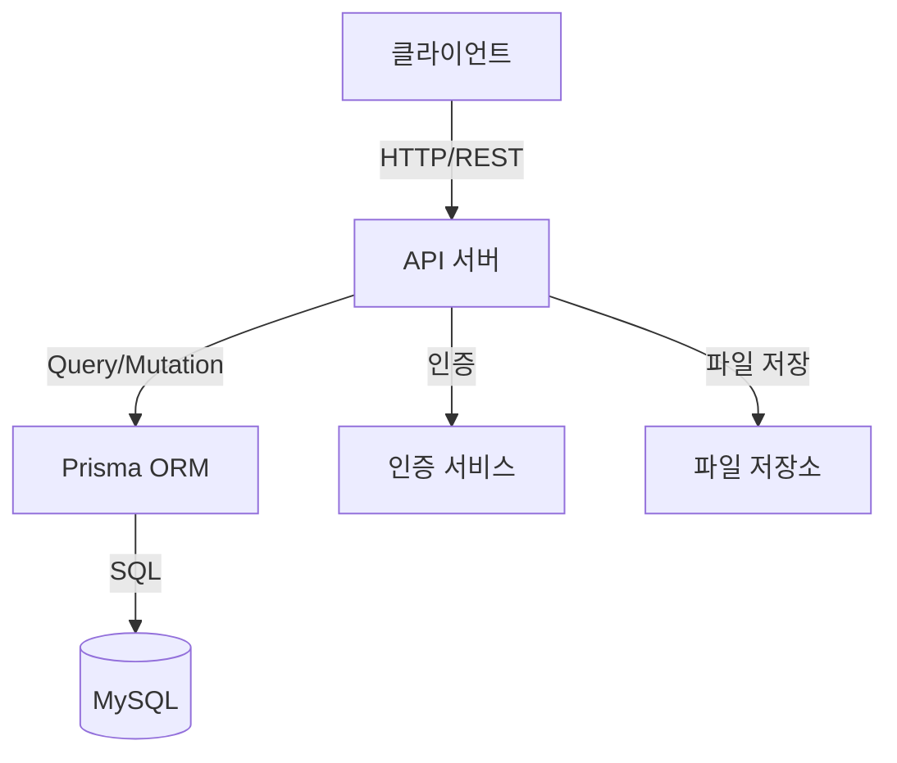

# 시스템 아키텍처

## 시스템 구조
프린터 관리 시스템은 다음과 같은 계층 구조로 설계되었습니다:

## 주요 컴포넌트
1. **API 서버**
   - Express.js 기반
   - REST API 제공
   - 비즈니스 로직 처리

2. **데이터베이스**
   - MySQL 8.0
   - Prisma ORM 사용
   - 트랜잭션 관리

3. **인증 서비스**
   - JWT 기반 인증
   - Role 기반 권한 관리

4. **파일 저장소**
   - 장비 매뉴얼 저장
   - 드라이버 파일 관리

## 상세 문서
- [데이터 흐름도 (DFD)](dfd.md)
- [ERD](erd.md)
- [API 구조](../api/README.md)