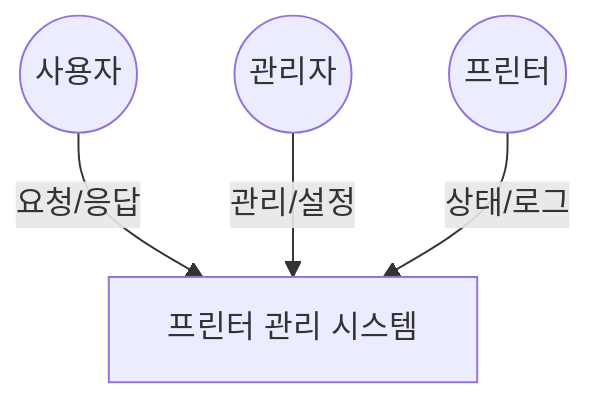
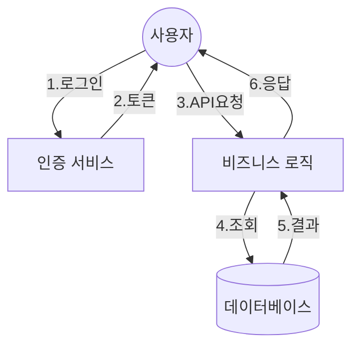
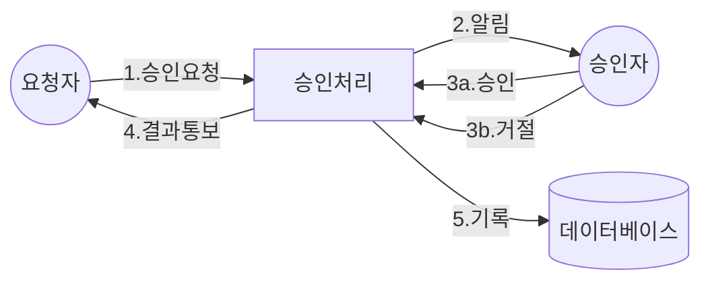
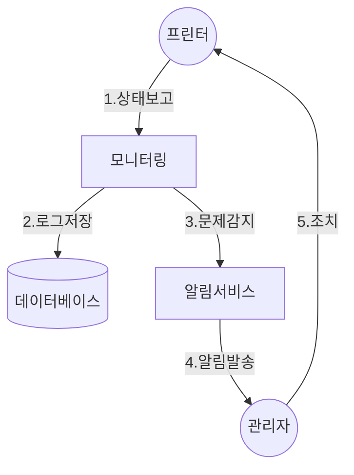

# 데이터 흐름도 (DFD)

## 1. 컨텍스트 다이어그램 (Level 0)

```mermaid
flowchart TD
    User((사용자))
    Admin((관리자))
    Device((프린터))
    System[프린터 관리 시스템]
    
    User --> |요청/응답| System
    Admin --> |관리/설정| System
    Device --> |상태/로그| System
```

## 2. 주요 프로세스 (Level 1)

```mermaid
flowchart TD
    User((사용자))
    Auth[인증 서비스]
    Process[비즈니스 로직]
    DB[(데이터베이스)]
    
    User --> |1.로그인| Auth
    Auth --> |2.토큰| User
    User --> |3.API요청| Process
    Process --> |4.조회| DB
    DB --> |5.결과| Process
    Process --> |6.응답| User
```

## 3. 승인 프로세스 (Level 2)

```mermaid
flowchart LR
    Req((요청자))
    Process[승인처리]
    Approver((승인자))
    DB[(데이터베이스)]
    
    Req -->|1.승인요청| Process
    Process -->|2.알림| Approver
    Approver -->|3a.승인| Process
    Approver -->|3b.거절| Process
    Process -->|4.결과통보| Req
    Process -->|5.기록| DB
```

## 4. 장비 관리 프로세스 (Level 2)

```mermaid
flowchart TD
    Device((프린터))
    Monitor[모니터링]
    DB[(데이터베이스)]
    Alert[알림서비스]
    Admin((관리자))
    
    Device -->|1.상태보고| Monitor
    Monitor -->|2.로그저장| DB
    Monitor -->|3.문제감지| Alert
    Alert -->|4.알림발송| Admin
    Admin -->|5.조치| Device
```