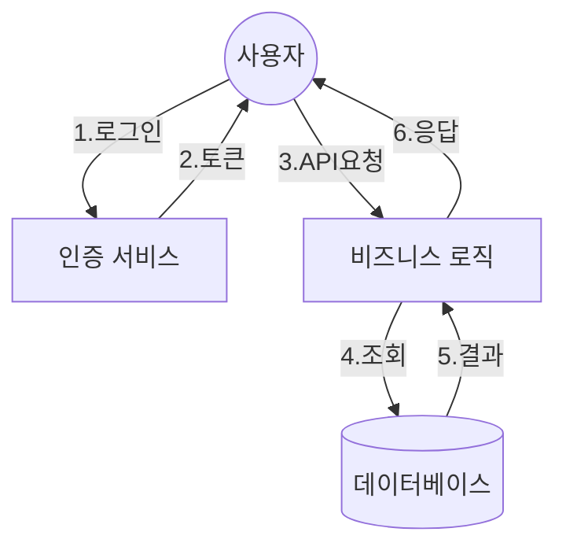
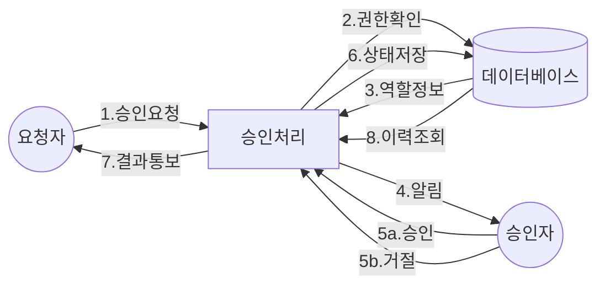
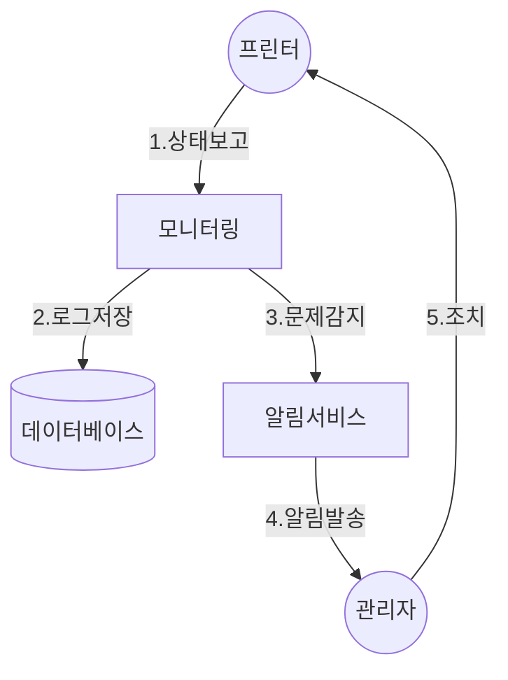

# 데이터 흐름도 (DFD)


## Level 0: 컨텍스트 다이어그램

```mermaid
# 데이터 흐름도 (DFD)

## Level 0: 컨텍스트 다이어그램

```mermaid
flowchart TD
    User((👤 일반사용자))
    Client((🏢 고객사))
    Receiver((📞 접수자))
    Admin((👨‍💼 관리자))
    Engineer((🔧 엔지니어))
    System[통합 관리 시스템]
    
    Client -->|장애신고| Receiver
    Receiver -->|콜등록/분배| System
    User -->|장비조회/승인요청| System
    Admin -->|시스템관리/승인| System
    Engineer -->|점검/설치/수리 정보입력| System
    
    System -->|알림/결과| User
    System -->|처리현황| Client
    System -->|콜현황/이력| Receiver
    System -->|현황/통계| Admin
    System -->|작업지시/이력| Engineer
```

## 2. 주요 프로세스 (Level 1)



## 3. 승인 프로세스 (Level 2)



## 4. 장비 관리 프로세스 (Level 2)

