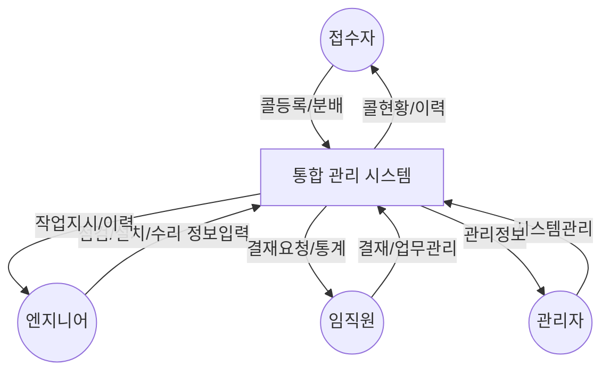
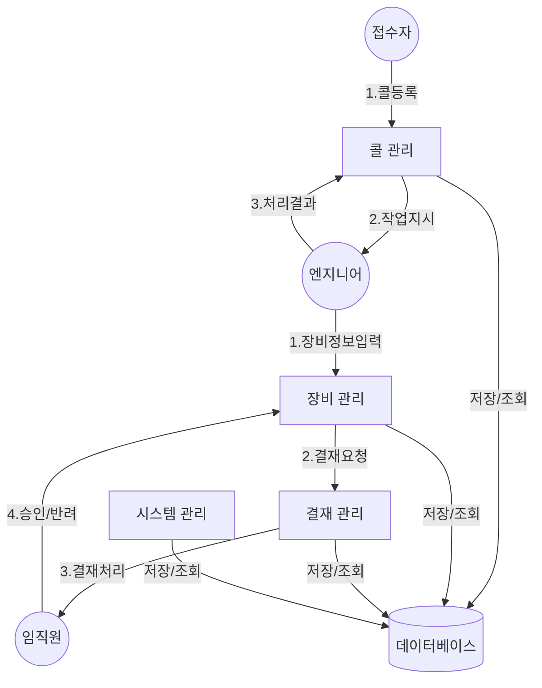
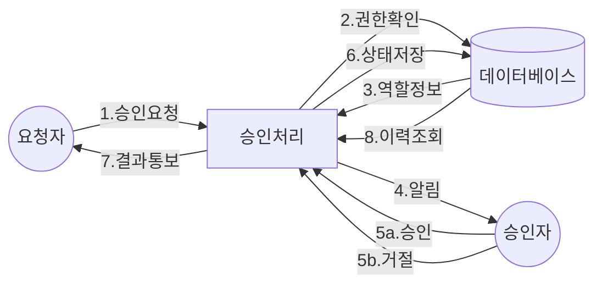
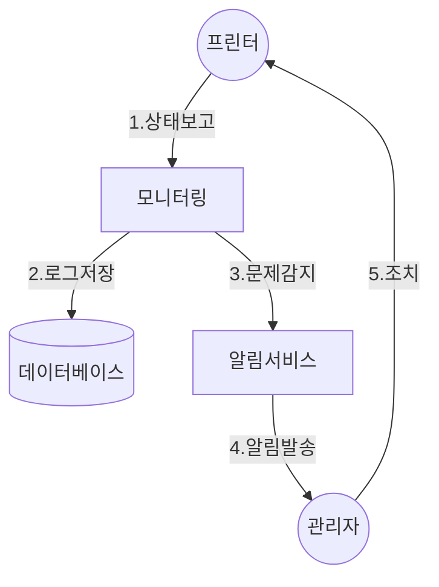

# 데이터 흐름도 (DFD)

## 1. Level 0: 컨텍스트 다이어그램

```mermaid
flowchart TD
    Receiver((접수자))
    Engineer((엔지니어))
    Employees((임직원))
    Admin((관리자))
    System[통합 관리 시스템]
    
    Receiver -->|콜등록/분배| System
    Engineer -->|점검/설치/수리 정보입력| System
    Employees -->|결재/업무관리| System
    Admin -->|시스템관리| System
    
    System -->|콜현황/이력| Receiver
    System -->|작업지시/이력| Engineer
    System -->|결재요청/통계| Employees
    System -->|관리정보| Admin
```
## 2. Level 1: 주요 프로세스

```mermaid
flowchart TD
    Receiver((접수자))
    Engineer((엔지니어))
    Employees((임직원))
    
    DB[(데이터베이스)]
    
    Call[콜 관리]
    Device[장비 관리]
    Approval[결재 관리]
    System[시스템 관리]
    
    Receiver -->|1.콜등록| Call
    Call -->|2.작업지시| Engineer
    Engineer -->|3.처리결과| Call
    
    Engineer -->|1.장비정보입력| Device
    Device -->|2.결재요청| Approval
    Approval -->|3.결재처리| Employees
    Employees -->|4.승인/반려| Device
    
    Call -->|저장/조회| DB
    Device -->|저장/조회| DB
    Approval -->|저장/조회| DB
    System -->|저장/조회| DB
```

## 3. 승인 프로세스 (Level 2)

```mermaid
flowchart LR
    Req((요청자))
    Process[승인처리]
    Approver((승인자))
    DB[(데이터베이스)]
    
    Req -->|1.승인요청| Process
    Process -->|2.권한확인| DB
    DB -->|3.역할정보| Process
    Process -->|4.알림| Approver
    Approver -->|5a.승인| Process
    Approver -->|5b.거절| Process
    Process -->|6.상태저장| DB
    Process -->|7.결과통보| Req
    DB -->|8.이력조회| Process
```

## 4. 장비 관리 프로세스 (Level 2)

```mermaid
flowchart TD
    Device((프린터))
    Monitor[모니터링]
    DB[(데이터베이스)]
    Alert[알림서비스]
    Admin((관리자))
    
    Device -->|1.상태보고| Monitor
    Monitor -->|2.로그저장| DB
    Monitor -->|3.문제감지| Alert
    Alert -->|4.알림발송| Admin
    Admin -->|5.조치| Device
```