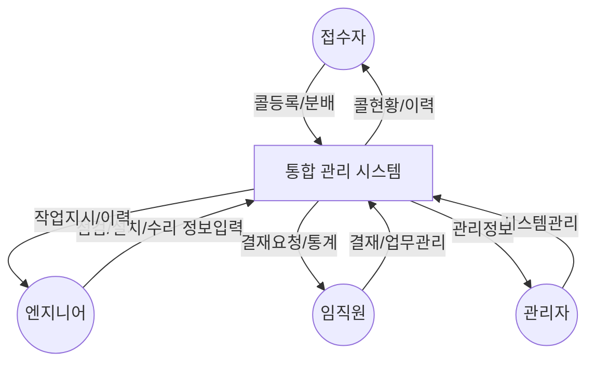
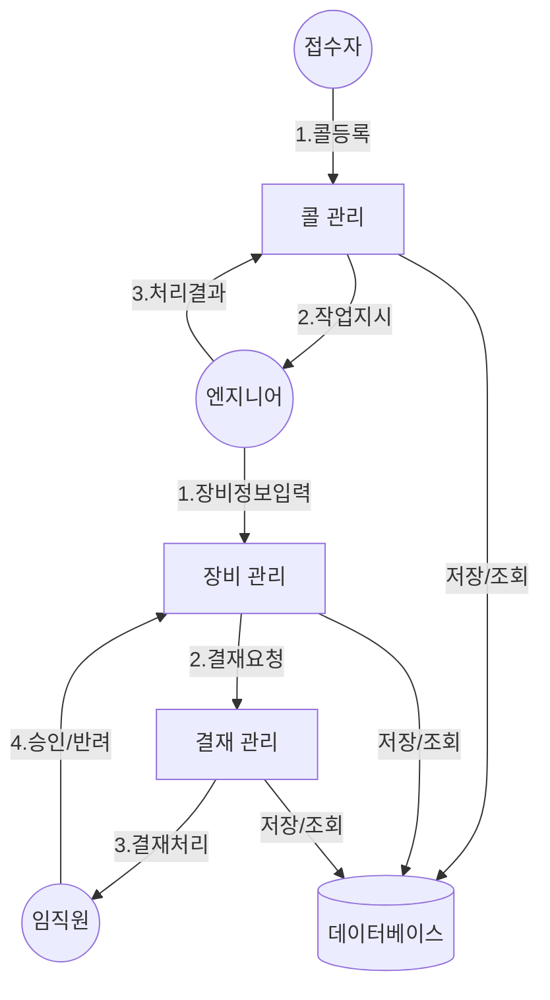
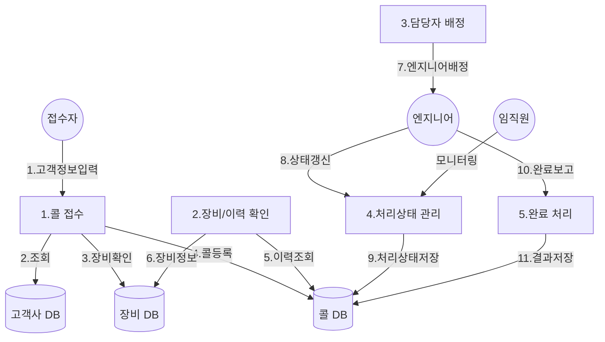
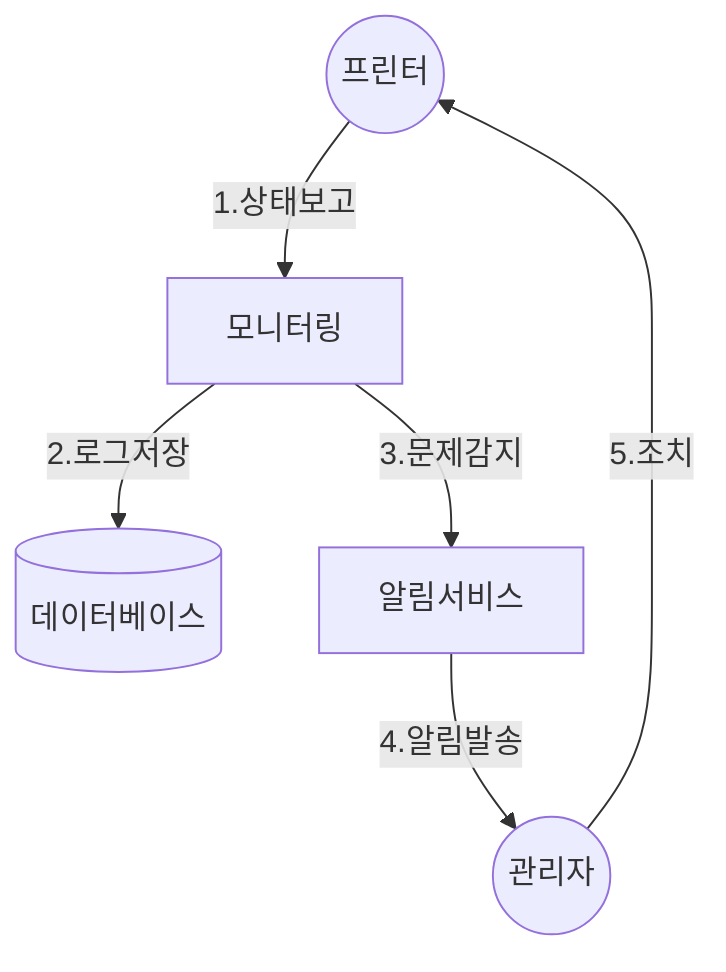

# 데이터 흐름도 (DFD)

## 1. 컨텍스트 다이어그램 (level 0)

```mermaid
flowchart TD
    Receiver((접수자))
    Engineer((엔지니어))
    Employees((임직원))
    Admin((관리자))
    System[통합 관리 시스템]
    
    Receiver -->|콜등록/분배| System
    Engineer -->|점검/설치/수리 정보입력| System
    Employees -->|결재/업무관리| System
    Admin -->|시스템관리| System
    
    System -->|콜현황/이력| Receiver
    System -->|작업지시/이력| Engineer
    System -->|결재요청/통계| Employees
    System -->|관리정보| Admin

    click System "https://github.com/daekyung23/back-end/docs/system-overview.md" "시스템 설명 보기"
```
## 2. 통합 관리 시스템 (Level 1)

```mermaid
flowchart TD
    Receiver((접수자))
    Engineer((엔지니어))
    Employees((임직원))
    
    DB[(데이터베이스)]
    
    Call[콜 관리]
    Device[장비 관리]
    Approval[결재 관리]
    
    Receiver -->|1.콜등록| Call
    Call -->|2.작업지시| Engineer
    Engineer -->|3.처리결과| Call
    
    Engineer -->|1.장비정보입력| Device
    Device -->|2.결재요청| Approval
    Approval -->|3.결재처리| Employees
    Employees -->|4.승인/반려| Device
    
    Call -->|저장/조회| DB
    Device -->|저장/조회| DB
    Approval -->|저장/조회| DB
```

## 3. 콜 관리 (Level 2)

```mermaid
flowchart TD
    Receiver((접수자))
    Engineer((엔지니어))
    Employees((임직원))
    
    DB_Call[(콜 DB)]
    DB_Device[(장비 DB)]
    DB_Client[(고객사 DB)]
    
    Register[1.콜 접수]
    Check[2.장비/이력 확인]
    Assign[3.담당자 배정]
    Process[4.처리상태 관리]
    Complete[5.완료 처리]
    
    Receiver -->|1.고객정보입력| Register
    Register -->|2.조회| DB_Client
    Register -->|3.장비확인| DB_Device
    Register -->|4.콜등록| DB_Call
    
    Check -->|5.이력조회| DB_Call
    Check -->|6.장비정보| DB_Device
    
    Assign -->|7.엔지니어배정| Engineer
    Engineer -->|8.상태갱신| Process
    
    Process -->|9.처리상태저장| DB_Call
    Engineer -->|10.완료보고| Complete
    Complete -->|11.결과저장| DB_Call
    
    Employees -->|모니터링| Process
```

## 4. 장비 관리 프로세스 (Level 2)

```mermaid
flowchart TD
    Device((프린터))
    Monitor[모니터링]
    DB[(데이터베이스)]
    Alert[알림서비스]
    Admin((관리자))
    
    Device -->|1.상태보고| Monitor
    Monitor -->|2.로그저장| DB
    Monitor -->|3.문제감지| Alert
    Alert -->|4.알림발송| Admin
    Admin -->|5.조치| Device
```