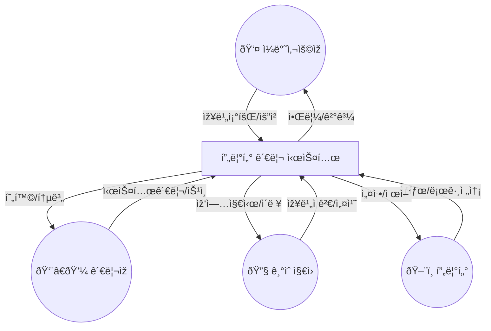
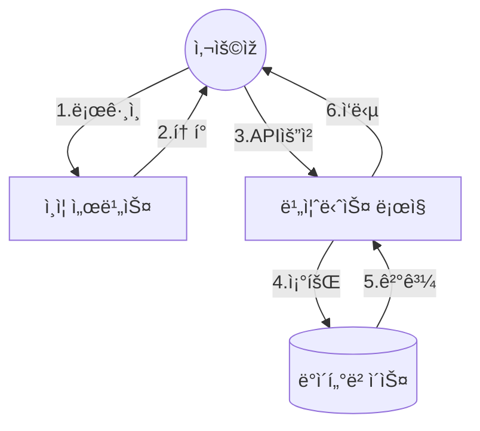
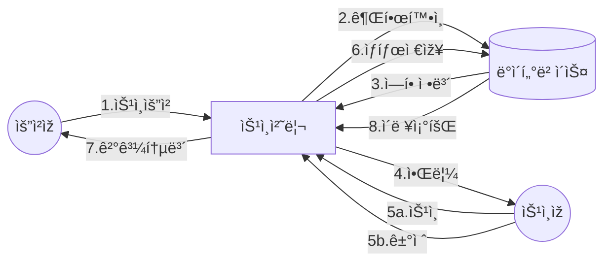
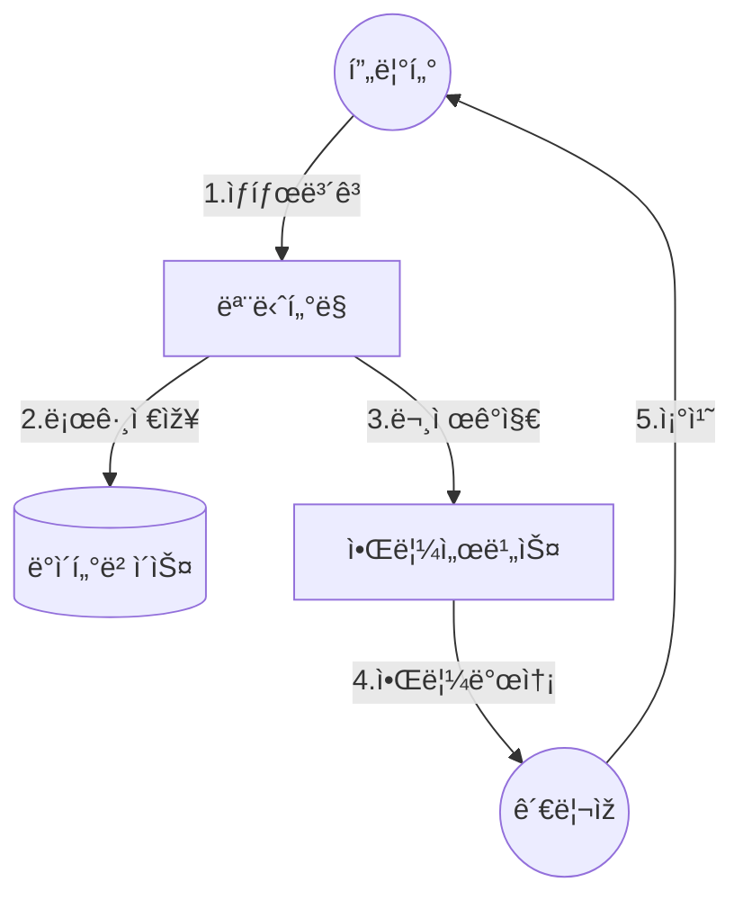

# ë°ì´í„° íë¦„ë„ (DFD)

## Level 0: 컨í…스트 다ì´ì–´ê·¸ëž¨

```mermaid
flowchart TD
    User((👤 ì¼ë°˜ì‚¬ìš©ìž))
    Admin((👨â€ðŸ’¼ 관리ìž))
    Tech((🔧 기술지ì›))
    Device((ðŸ–¨ï¸ í”„ë¦°í„°))
    System[프린터 관리 시스템]
    
    User -->|장비조회/요청| System
    Admin -->|시스템관리/승ì¸| System
    Tech -->|장비ì ê²€/설치| System
    Device -->|ìƒíƒœ/로그전송| System
    
    System -->|알림/결과| User
    System -->|현황/통계| Admin
    System -->|작업지시/ì´ë ¥| Tech
    System -->|설정/제어| Device
```

## 2. 주요 프로세스 (Level 1)

```mermaid
flowchart TD
    User((사용ìž))
    Auth[ì¸ì¦ 서비스]
    Process[비즈니스 ë¡œì§]
    DB[(ë°ì´í„°ë² ì´ìŠ¤)]
    
    User --> |1.로그ì¸| Auth
    Auth --> |2.토í°| User
    User --> |3.API요청| Process
    Process --> |4.조회| DB
    DB --> |5.ê²°ê³¼| Process
    Process --> |6.ì‘답| User
```

## 3. ìŠ¹ì¸ í”„ë¡œì„¸ìŠ¤ (Level 2)

```mermaid
flowchart LR
    Req((요청ìž))
    Process[승ì¸ì²˜ë¦¬]
    Approver((승ì¸ìž))
    DB[(ë°ì´í„°ë² ì´ìŠ¤)]
    
    Req -->|1.승ì¸ìš”ì²­| Process
    Process -->|2.권한확ì¸| DB
    DB -->|3.ì—­í• ì •ë³´| Process
    Process -->|4.알림| Approver
    Approver -->|5a.승ì¸| Process
    Approver -->|5b.ê±°ì ˆ| Process
    Process -->|6.ìƒíƒœì €ìž¥| DB
    Process -->|7.결과통보| Req
    DB -->|8.ì´ë ¥ì¡°íšŒ| Process
```

## 4. 장비 관리 프로세스 (Level 2)

```mermaid
flowchart TD
    Device((프린터))
    Monitor[모니터ë§]
    DB[(ë°ì´í„°ë² ì´ìŠ¤)]
    Alert[알림서비스]
    Admin((관리ìž))
    
    Device -->|1.ìƒíƒœë³´ê³ | Monitor
    Monitor -->|2.로그저장| DB
    Monitor -->|3.문제ê°ì§€| Alert
    Alert -->|4.알림발송| Admin
    Admin -->|5.조치| Device
```