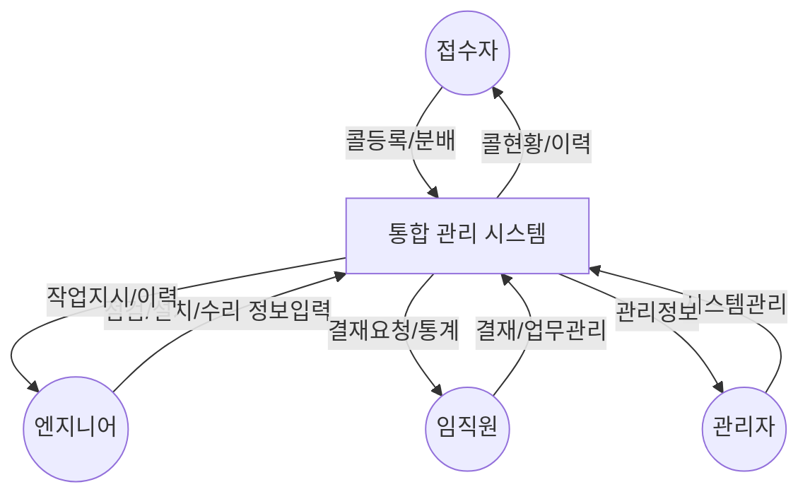

# Level 0: 컨텍스트 다이어그램

## 시스템 컨텍스트
이 다이어그램은 프린터 통합 관리 시스템과 외부 사용자들 간의 상호작용을 보여줍니다.

## 주요 액터 설명

### 접수자
- 고객사로부터 장애/점검 요청 접수
- 콜 등록 및 엔지니어 배정
- 처리 현황 모니터링

### 엔지니어
- 현장 점검/설치/수리 수행
- 장비 상태 및 이력 정보 입력
- 작업 완료 보고

### 임직원
- 각종 결재 처리
- 업무 현황 관리
- 통계 및 보고서 확인

### 관리자
- 시스템 설정 관리
- 코드/권한 관리
- 기준정보 관리

## 주요 데이터 흐름
1. 접수자 ↔ 시스템
   - 콜 접수 정보
   - 처리 현황 정보

2. 엔지니어 ↔ 시스템
   - 작업 지시서
   - 처리 결과 보고

3. 임직원 ↔ 시스템
   - 결재 요청/처리
   - 업무 통계/현황

4. 관리자 ↔ 시스템
   - 시스템 설정
   - 관리 정보