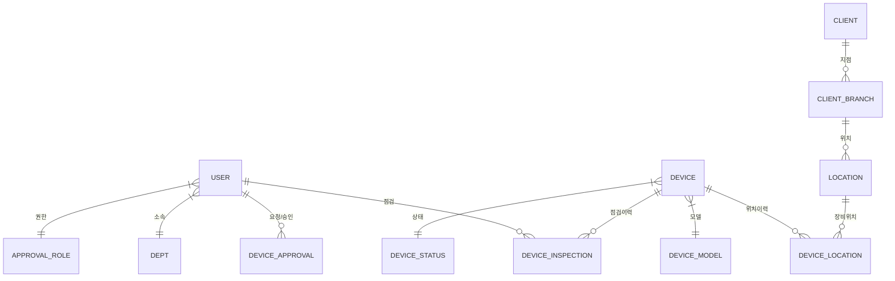
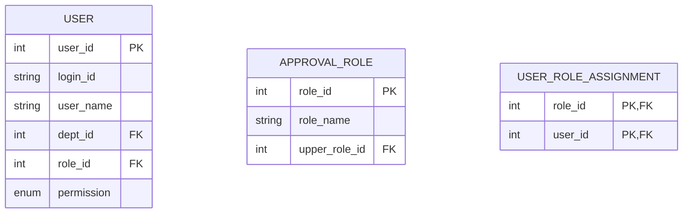
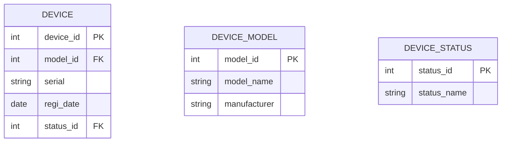
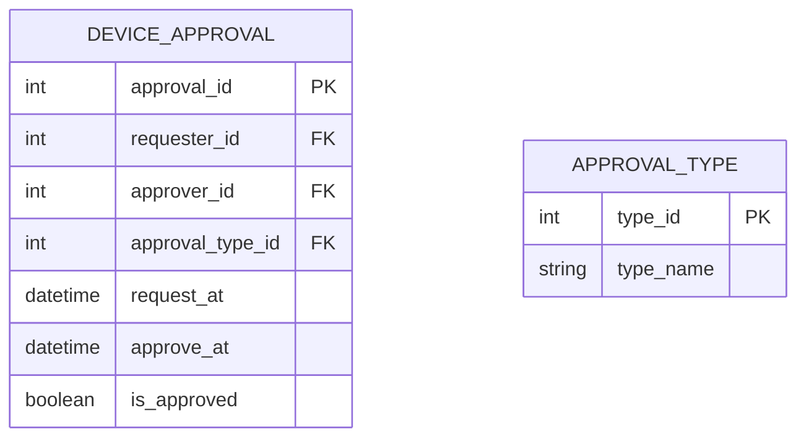

# ERD (Entity Relationship Diagram)

## 전체 데이터베이스 구조

```mermaid
erDiagram
    USER ||--o{ DEVICE_APPROVAL : "요청/승인"
    USER ||--o{ DEVICE_INSPECTION : "점검"
    USER }|--|| DEPT : "소속"
    USER }|--|| APPROVAL_ROLE : "권한"
    
    DEVICE ||--o{ DEVICE_INSPECTION : "점검이력"
    DEVICE ||--o{ DEVICE_LOCATION : "위치이력"
    DEVICE }|--|| DEVICE_MODEL : "모델"
    DEVICE }|--|| DEVICE_STATUS : "상태"
    
    CLIENT ||--o{ CLIENT_BRANCH : "지점"
    CLIENT_BRANCH ||--o{ LOCATION : "위치"
    LOCATION ||--o{ DEVICE_LOCATION : "장비위치"
```

## 주요 엔티티 설명

### 1. 사용자 관련

```mermaid
erDiagram
    USER {
        int user_id PK
        string login_id
        string user_name
        int dept_id FK
        int role_id FK
        enum permission
    }
    APPROVAL_ROLE {
        int role_id PK
        string role_name
        int upper_role_id FK
    }
    USER_ROLE_ASSIGNMENT {
        int role_id PK,FK
        int user_id PK,FK
    }
```

### 2. 장비 관련

```mermaid
erDiagram
    DEVICE {
        int device_id PK
        int model_id FK
        string serial
        date regi_date
        int status_id FK
    }
    DEVICE_MODEL {
        int model_id PK
        string model_name
        string manufacturer
    }
    DEVICE_STATUS {
        int status_id PK
        string status_name
    }
```

### 3. 승인 관련

```mermaid
erDiagram
    DEVICE_APPROVAL {
        int approval_id PK
        int requester_id FK
        int approver_id FK
        int approval_type_id FK
        datetime request_at
        datetime approve_at
        boolean is_approved
    }
    APPROVAL_TYPE {
        int type_id PK
        string type_name
    }
```