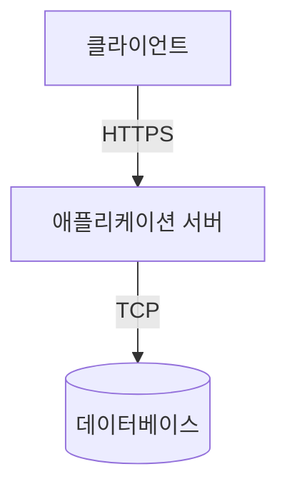

# 시스템 구조

## 개요
프린터 통합 관리 시스템의 물리적 구성과 배포 환경을 설명합니다.

## 전체 구성도

## 주요 컴포넌트

### 1. 클라이언트
- 웹 브라우저 기반
- React SPA 애플리케이션
- REST API 통신

### 2. 애플리케이션 서버
- Node.js 런타임
- Express 웹 서버
- REST API 제공

### 3. 데이터베이스
- MySQL 8.0
- 마스터-슬레이브 구성
- 자동 백업

## 상세 문서
- [인프라 구성](infrastructure.md)
- [배포 구성](deployment.md)